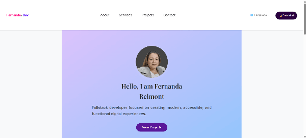

# 🌐 Personal Portfolio Website

This is my personal portfolio website, designed and developed to showcase my skills, projects, and experience as a Full Stack Developer.

👉 [Check it out here](https://nandabri.github.io/myPortfolio/)

---

## 💡 About the Project

This project was built using **HTML**, **CSS**, and **JavaScript**.
I focused on creating a clean, responsive, and accessible design.

---

## 🛠️ Features

- 📱 **Responsive design** — adapts to all screen sizes
- 🎨 **Modern & clean UI**
- 💡 **Project showcase** with descriptions and links
- 🧩 **Contact section** for visitors to get in touch
- 🌙 **Dark/Light mode toggle**

---

## 🚀 Technologies Used

- **HTML5** — semantic markup
- **CSS3** — custom styles and layout
- **JavaScript** — interactivity

---

## 📸 Preview

---

## ⚖️ License

This project is open for learning purposes. Feel free to get inspired, but please don’t copy. © 2025 All rights reserved | Designed and developed by Fernanda Belmont

**Thank you for visiting my portfolio! 💖✨**
